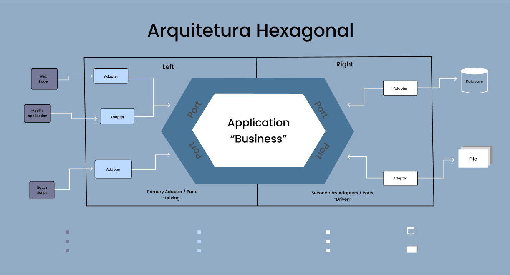

# ⬢ nodejs-hexagonal-project

> 🧩 Projeto desenvolvido para estudo da **Arquitetura Hexagonal (Ports & Adapters)** utilizando Node.js.

---

## 📦 Sobre o Projeto

Este projeto tem como objetivo demonstrar, na prática, a aplicação da **Arquitetura Hexagonal (Ports & Adapters)**, utilizando uma API simples de autenticação de usuários (cadastro e login).

A proposta é evidenciar como as regras de negócio podem permanecer desacopladas de tecnologias externas, como banco de dados, criptografia e frameworks, facilitando a manutenção, testabilidade e evolução do sistema.

Além disso, o projeto foi desenvolvido com finalidade acadêmica, como parte de um estudo sobre padrões arquiteturais, sendo apresentado em sala de aula para consolidar o entendimento sobre separação de responsabilidades e boas práticas de desenvolvimento.

---


## 🛠️ Funcionalidades

- Estrutura baseada em camadas bem definidas
- Implementação de casos de uso (Use Cases)
- Interfaces (Ports) para comunicação entre camadas
- Adaptadores para banco de dados e serviços externos
- Organização modular e escalável

---

## 🧱 Estrutura do Projeto

```bash
database/
└── schema.sql

src/
├── adapters/
│   ├── in/                  # Entrada (controllers / DTOs)
│   │   ├── dtos/
│   │   │   └── login.dto.js
│   │   └── auth.controller.js
│   │
│   └── out/                 # Saída (implementações)
│       ├── bcrypt.adapter.js
│       ├── jwt.adapter.js
│       └── user.repository.js
│
├── domain/
│   └── user/
│       ├── user.entity.js
│       └── user.use-cases.js
│
├── infra/
│   └── database/
│       └── connection.js
│
├── ports/
│   ├── in/
│   │   └── http/
│   │       └── auth.router.js
│   │
│   └── out/
│       └── user.repository.port.js
│
app.js
```
---


## 🧱 Diagrama da Arquitetura

[](https://www.figma.com/design/ZZDfGu5Q4ifXq3H2IMUaQd/Sem-t%C3%ADtulo?node-id=0-1&p=f&t=fZwRMX81gz0FtGrz-0)
[]()


<p align="center">
  
</p>


Grupo:
[@EmilySouza22](https://github.com/EmilySouza22)
[@Lwbane](https://github.com/LwBane)
[@francagiovanna](https://github.com/francagiovanna)
[@Alioliv](https://github.com/Alioliv)